Setting up document search requires three core components:
1) watsonx Discovery
2) watsonx.ai
3) watsonx Assistant

## Watson Discovery
-----
:::note
    **Prerequisite Required:** Watson Discovery Instance
:::

1.  Under new projects, input a project name ("IT Helpdesk" for example). Select the option **"Conversational Search"** then click Next.
      - 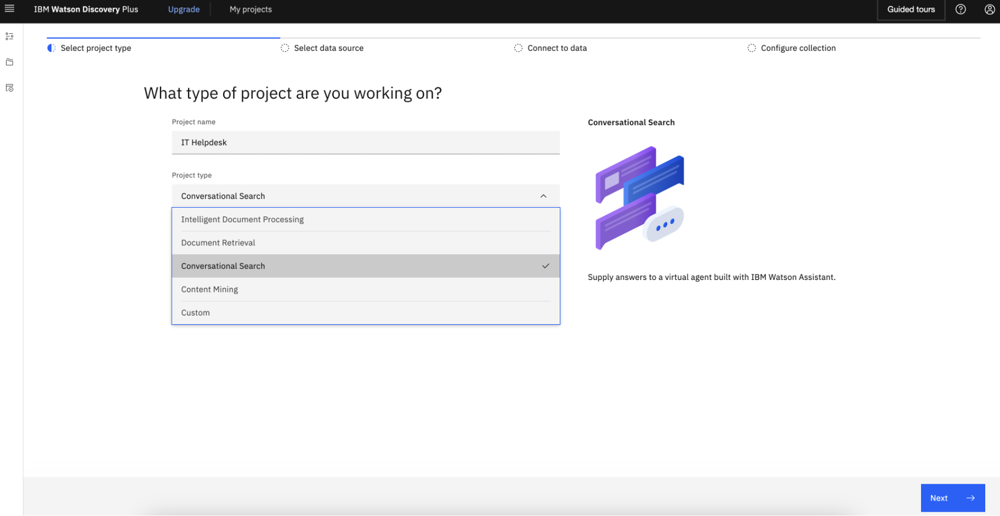
2.  Input a collection name.
      - 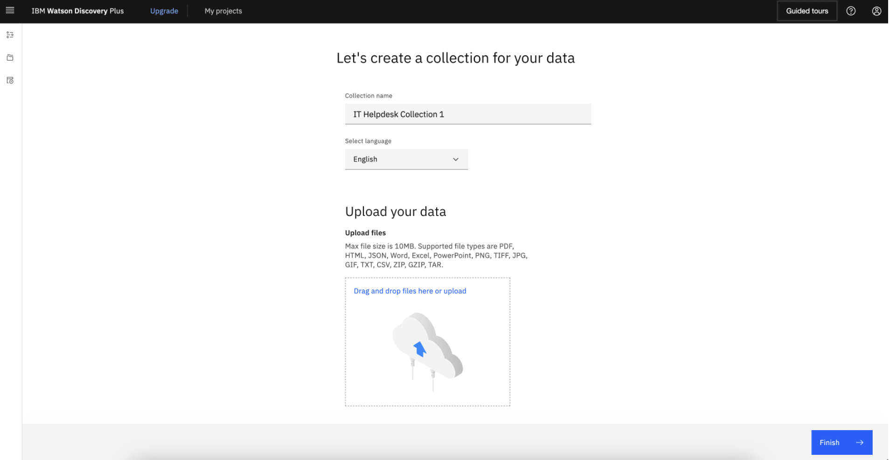
3.  Upload the file that will serve as the knowledge base. It should look like the following once you have uploaded. The uploaded data are being processed. It will take a couple minutes and we’ll move on to the following sections first.
      - 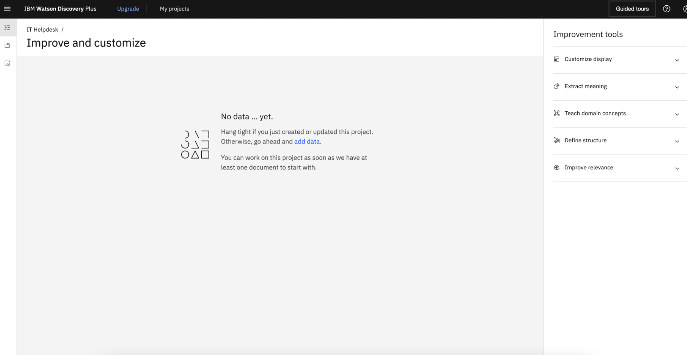

### Optional Data Connectors
In addition to direct upload data, in the Upload data section, select the _here_ hyperlink at the end of "Need to connect to a data source? Click **here**"
    1. **OPTION 1 - Web Crawl**
       1. Click "Web Crawl" then click Next
       2. Input starting URL then click "Add" to add and repeat for all the domains.
       3. Navigate to the upper-left hamburger icon, then go to Manage Collections, then New collections.
       4. Select a data source.
       5. If utilizing a webcrawl, input the url links to "Starting URLs" and click "Add" then Finish.
    2. **OPTION 2 - Cloud Object Storage**
       - To access files such as PDFs, CSVs, or HTML through Cloud Object Storage (COS) requires **COS Configuration** and setting up Watson Discovery accordingly.

## watsonx.ai Setup
-----
:::note
    **Prerequisite Required:** watsonx.ai Instance
:::
- Within IBM Cloud's Resource List, Expand “AI/Machine Learning” and click on wa-itz-itz-xxx with Product “Watson Studio”
   - 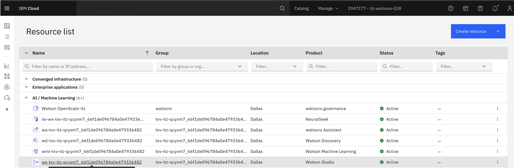
- Click “Launch in” and select “IBM watsonx” from dropdown list
   - 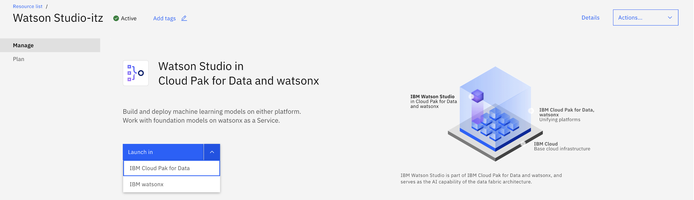
- Click on the upper-left “Navigation Menu” and click “View all projects”
- Click “New Project”
   - 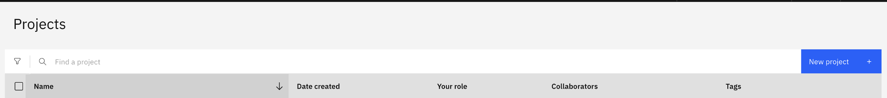
- You’d see the following view. For Name, enter a relevant project name, and click “Create”
   - 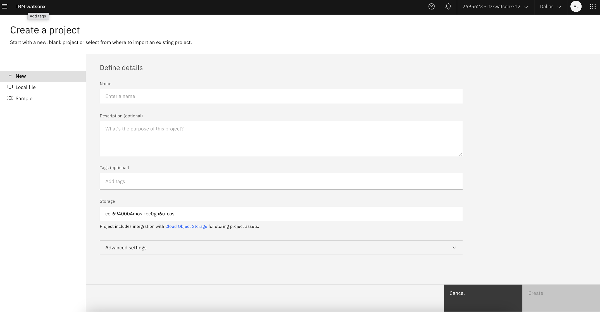
- You have created a new watsonx project! You’d see the following view. 
   - 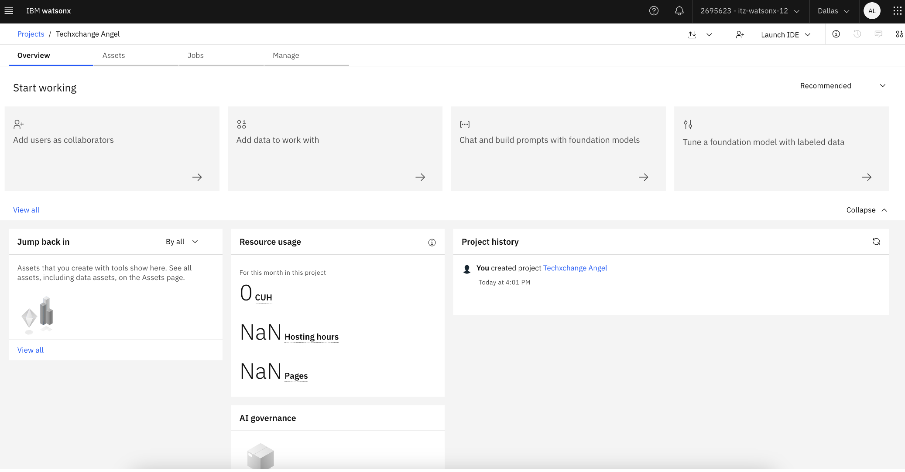
- Once on the project home screen navigate to the manage tab. Note down the project id, you'll need this later when configuring watsonx.ai in watsonx Assistant:
   - 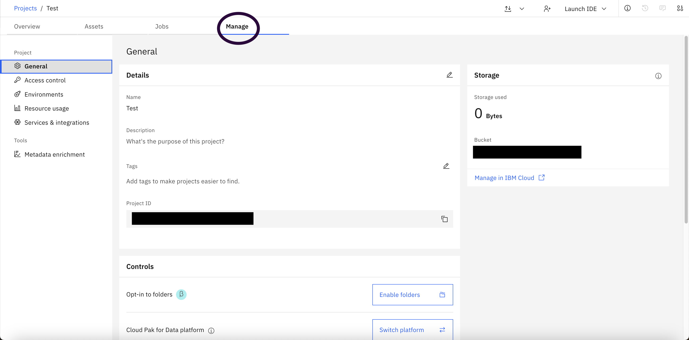
- Next, associate a Watson Machine Learning Instance to your project. Navigate to the Services and Integrations tab and then click on Associate service:
   - 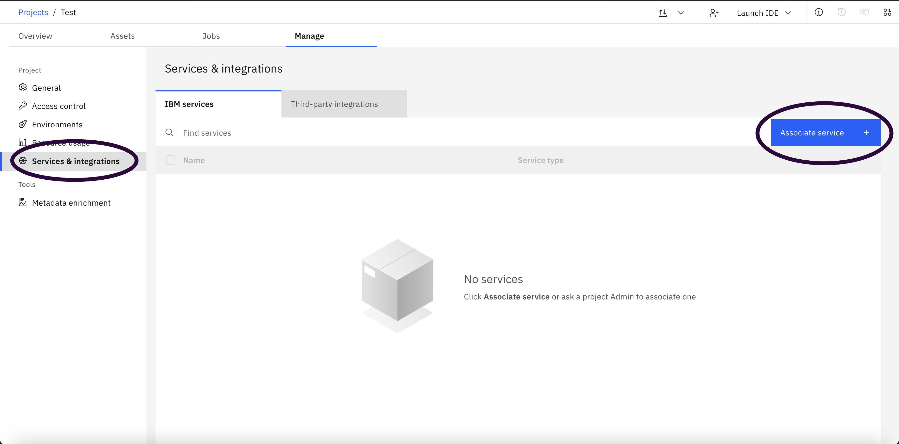
- Finally, check the Waston Machine Learning box to associate the instance to your project:
   - 

## watsonx Assistant
-----
:::note
* **Prerequisite Required:** Watsonx Assistant Instance
* **Prerequisite Required:** Watson Discovery Instance
* **Prerequisite Required:** watsonx.ai Instance
:::

### Create Watsonx Assistant
If you do not have an Watsonx Assistant, create new bot and fill in all required information. Please see details section below.

   1. Fill in Assistant name (for example “IT Helpdesk”), and click “Next”.
      - 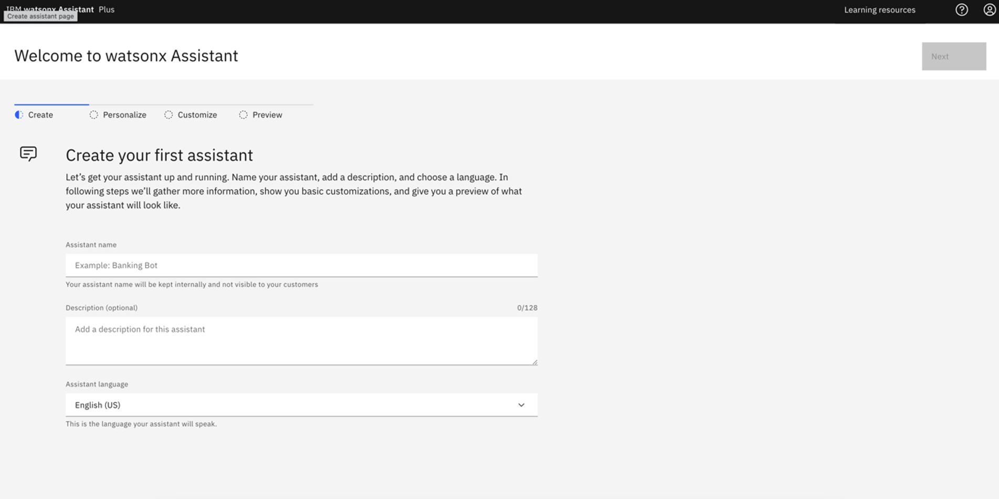
   1. You’d see the following view. Fill in the form and click “Next”.
      - 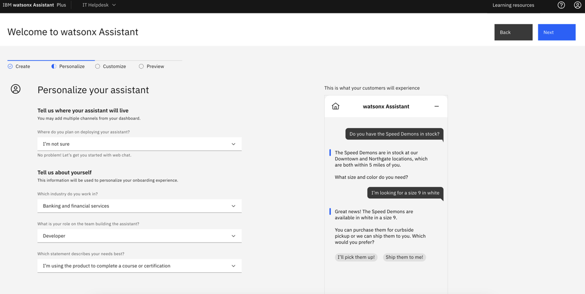
   1. Fill in a name for you assistant. For example, enter “IT Assistant”. Click “Next”
      - 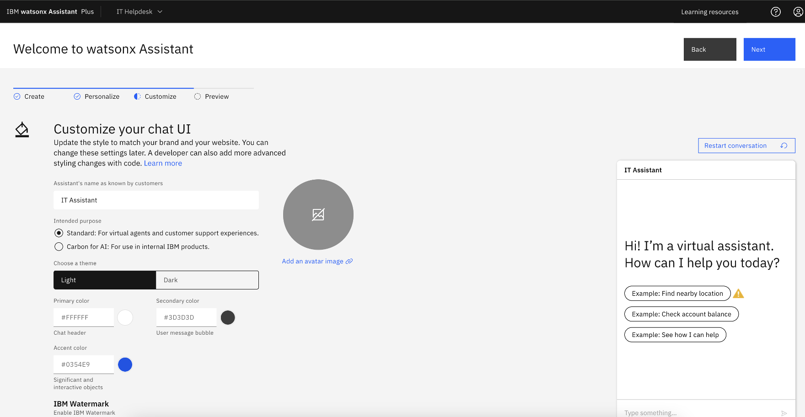
   1. You’d see the following view. Click “Create” to complete creation of your watsonx Assistant.
      - 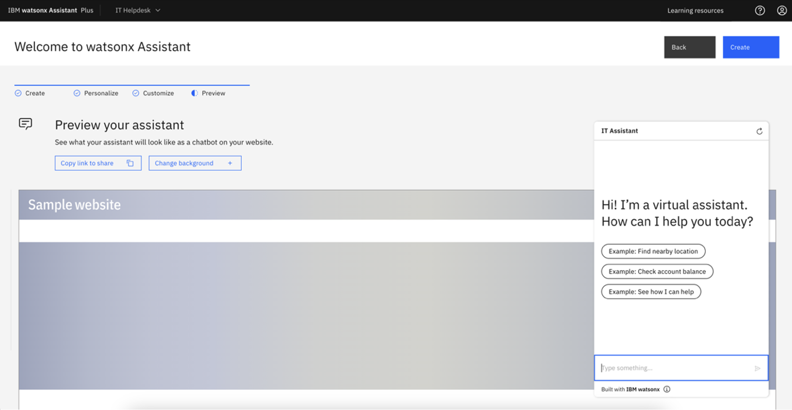

### Create Watson Discovery Custom Extension
1. Once created, in your assistant, navigate to "Integrations" page.
1. Click "Build custom extensions" -> click "Next" -> Input Extension name `Watson Discovery` -> click "Next"
1. Download the Watson Discovery OpenAPI json file: [watson-discovery-query-openapi.json](https://github.com/watson-developer-cloud/assistant-toolkit/blob/master/integrations/extensions/starter-kits/watson-discovery/watson-discovery-query-openapi.json) and import file to WA. This file contains the configuration to enable accessing to watson discovery from watsonx assistant.
1. click "Next" -> click "Finish"
1. Lower Right corner of the Watson Disovery extension, click "Add" -> click "Add" -> click "Next"
   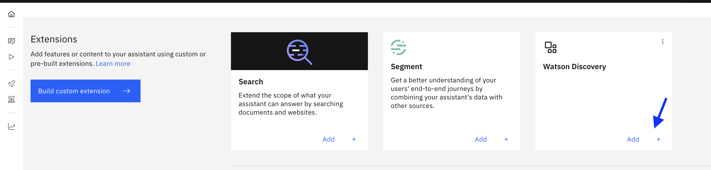
1. In Authentication page, in the Authentication type dropdown, select "Basic auth"
   1. For Username enter `apikey`
   1. For password and discovery_url, within IBM Cloud -> resource list -> click on you Watson Discovery Instance
   1. You'd see the following view.
      1. Copy **API Key** and paste it in _Password_ field.
      1. Copy **URL** and paste it in _discovery_url_ and remove `https://` from the beginning of the string
         
1. Click "Next", click "Finish", click "Close"

### Create watsonx.ai Custom Extension

1.  In your assistant, navigate to Integrations page, click "Build custom extension" -> click "Next" -> Input Extension name `watsonx.ai` -> click "Next" .
1.  download json file: [watsonx-openapi.json](https://github.com/watson-developer-cloud/assistant-toolkit/blob/master/integrations/extensions/starter-kits/language-model-watsonx/watsonx-openapi.json) and import file to WA
1.  click "Next" -> click "Finish"
1.  Lower Right corner of the watsonx extension, click "Add" -> click "Add" -> click "Next"
1.  In Authentication page, in the Authentication type dropdown, select "OAuth 2.0"
    1. For Apikey, create and copy a new API key from [API key](https://cloud.ibm.com/iam/apikeys)
    1. For Server variables, select the region that matches where your environment is configured in.
1.  Click "Next", click "Finish", click "Close"
1.  Your Extensions section will appear as following screenshot once both Watson Discovery and watsonx.ai custom extensions were configured.  
    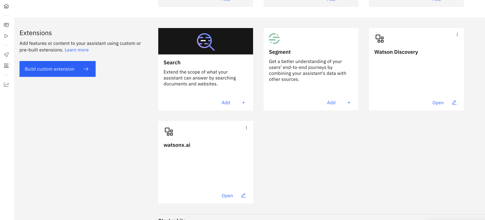

### Enable Document search
To enable the document search capability, you'll need to configure Watsonx.ai and Watson Discovery to work with Watsonx Assistant through its actions.

##### Upload Actions:
1. On the Actions page of watsonx Assistant, click on Global Settings.
2. On the Upload/Download tab, click the Upload button and upload [this actions.json file](https://github.com/watson-developer-cloud/assistant-toolkit/blob/master/integrations/extensions/starter-kits/language-model-conversational-search/discovery-watsonx-actions.json) or the file that was given to you by your IBM instructors.
3. Configure the "Invoke watsonx generation API" action
   1. On Step 1, click "Edit extension" to setup watsonx.ai custom extension.
      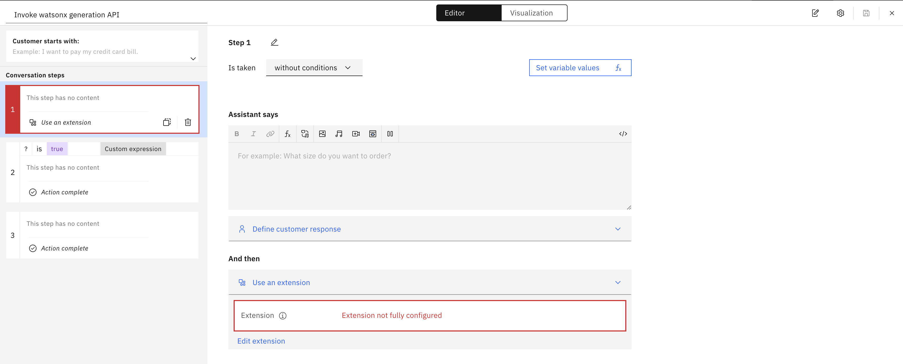
   2. For the Extension options, select "watsonx.ai" and for the Operation options, select "Generation"
   3. For "Parameters", configure the following to pass the these variables to the watsonx.ai custom extension properly.
      1. set **version** to `watsonx_api_version` variable
      2. set **input** to `model_input` variable
      3. set **model_id** to `model_id` variable
      4. set **project_id** to `watsonx_project_id` variable
         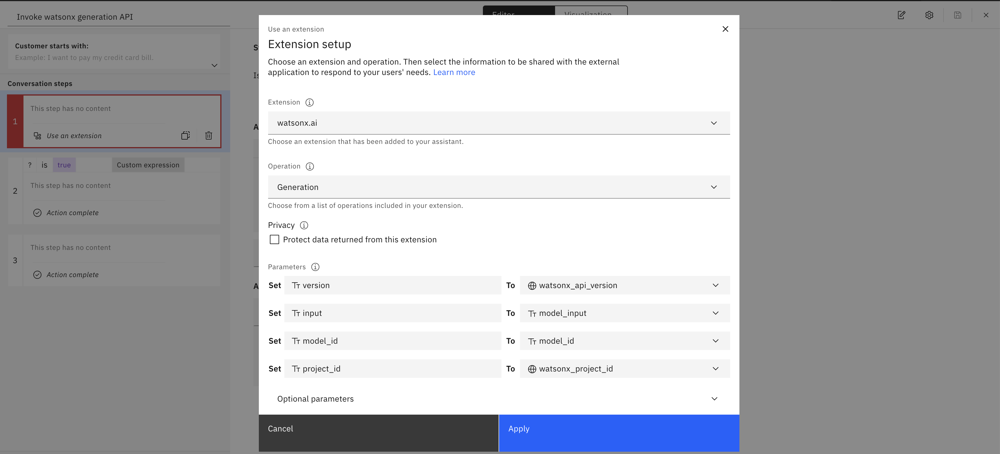
   4. Click "Apply", and click "Save".

##### Update session variables:

1. within the Actions page, navigate to "Actions / Variables / Created by you".
   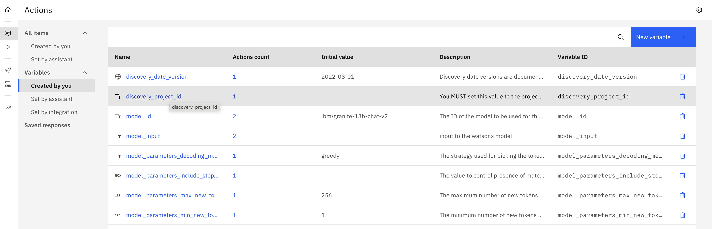
1. Set `discovery_project_id` and `watsonx_project_id` session variable
   :::info
   **Where to get credentials**
   - **discovery_project_id**: within Watson Discovery: Upper left Hamburger icon -> Integrate and deploy -> API Information. Copy Project ID and navigate back to watsonx assistant to paste it in the `Initial value` box of this Session variable.
   - **watsonx_project_id**: - Go to [watsonx Platform](https://dataplatform.cloud.ibm.com/wx/home?context=wx) - If you do not have an project, create a new project. - **Check Services & integrations**: Within the project, navigate to Manage -> Services & Integrations. If no services is associated, click "Associate Service" -> select "Watson Machine Learning" -> click "Associate". - Once you confirm WML is associated, Navigate to Manage -> General -> Details -> Project ID. Copy Project ID and navigate back to watsonx assistant to paste it in the `Initial value` of this Session variable.
     :::
1. Once you've finished configuring the variables, click "Preview" on the lower right corner, and type in questions to test the Conversational Search in your assistant!
   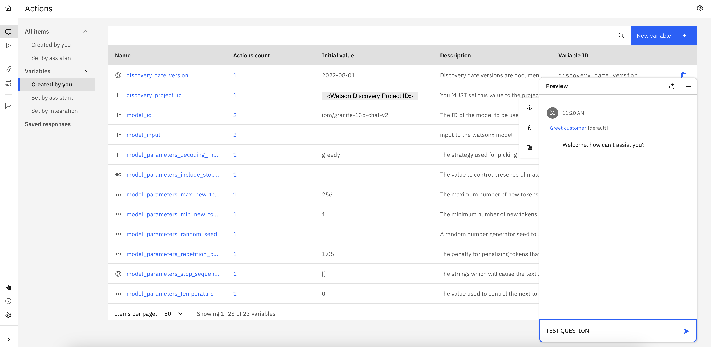

---

### Final Check
Once the **watsonx Assistant development** is fully complete, you should see the status of actions showing green checkmarks, similar to screenshot below.
