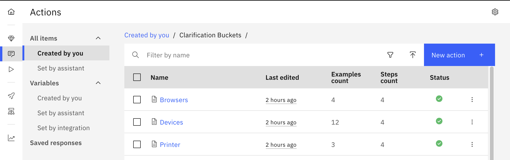

## Overview
To incorporate a disambiguation method there are two core steps:
1. Leverage an LLM to identify all the "topics" within a particular data corpus and its relevant entities.
2. Build watsonx assistant actions for each identified "topic" in the data corpus and create a step to provide all the relevant entities as options to the user when a topic is mentioned by the end user.
3. Combine the user's selected option with their document search request and present the clarified answer to them.

## How to Implement
1. Leverage a python script and the watsonx sdk to determine all the topics within a data corpus and the relevant entities.

    **Example Topics/Entities:**
    | Topic    | Entities                |
    | -------- | ----------------------- |
    | Browser  | Chrome, Safari, Firefox |
    | Devices | iPhone, Android          |
    | Printer    | model A, model B      |

2. Build watsonx Assistant actions for each topic and build a step to surface the entities as options to the user
    

3. Combine the user's selected option with their document search request and present the clarified answer to them.
    
